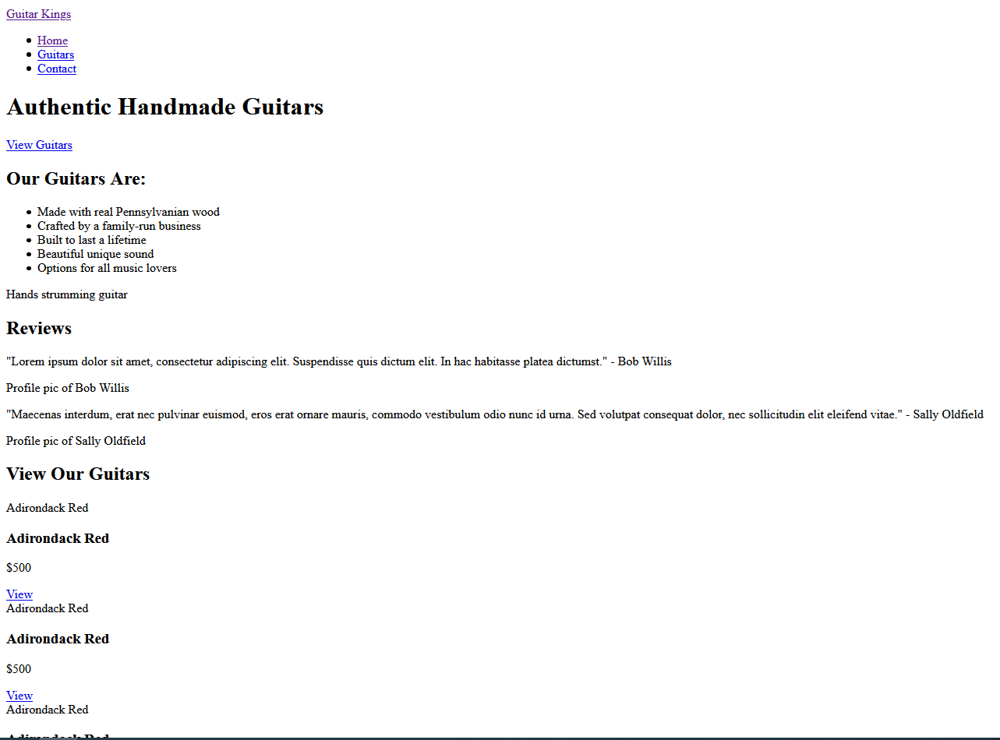

# HTML and CSS - Module 1

## Task 1

In our lesson tasks we're going to be building a website for a company called 'Guitar Kings'. It is a four page website showcasing their guitars. You can find a prototype of the website in this repository.

### Brief

In this lesson task we are going to be building the HTML for the home page. You should build the HTML for the home page by yourself, then when you have finished building the page, you should switch to the 'answers' branch where I will have pushed code to see how the site could be built. I will also be including a video of me building the site.

You only need to build the home page for now, and you don't need to style it at all. The focus in this lesson task is on writing semantic, neat HTML.

By the end of the lesson task, your home page should look like this: 
